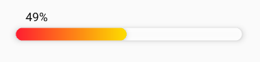
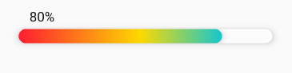
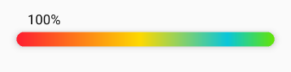

# rn-colorful-selectable-progress

selectable progress bar with colorful ui for react native


**install**
```
yarn add rn-colorful-selectable-progress

or

npm install --save rn-colorful-selectable-progress
```








**usage**
```
import React from 'react';
import {StyleSheet, View} from 'react-native';
import {ProgressBar} from 'rn-colorful-selectable-progress';

const styles = StyleSheet.create({
  container: {
    alignSelf: 'center',
  },
});

export default function App() {
  return (
    <View style={styles.container}>
      <ProgressBar getProgressPercent={percent => console.log(percent)} />
    </View>
  );
}
```

| prop | default | description |
| --- | --- | --- |
| fontFamily | system font | percent text fontFammily |
| barBackground | "#ffffffee" | backgroundColor of bar |
| barWidth | 350 | width of bar |
| barHeight | 20 | height of bar |
| barStyle | ... | style of bar |
| percentTextStyle | ... | style of percent text |
| colors | ['#fe2130', '#fdd900', '#09c6da', '#62e408'] | array of progress colors |
| locations | [0.01, 0.48, 0.82, 1] | array of colors locations |
| getProgressPercent | () => {} | callback for get percent when bar is touched |


